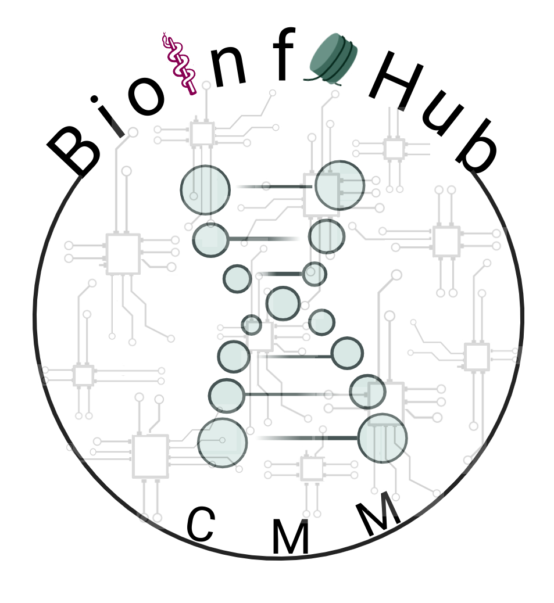

# Welcome to the BioinfoHub!

    

  

Welcome to the **BioinfoHub at the Center for Molecular Medicine (CMM)**, where we collaborate, learn, and innovate in bioinformatics! Stay tuned for updates, new repositories, and upcoming events!

## Menu

- [Upcoming Events](#upcoming-events)
- [Olink Data Analysis Repository](https://github.com/BioinfoHubCMM/olink)
- [Repository 2](https://github.com/your-org/repo2)

---

### Connect with Us
Do you want to help with the organization of the events? get in contact with us:

**Lina Diaz:** lina.diaz@ki.se  
**Ana Cristina Gonzalez:** ana.cristina.gonzalez.sanchez@ki.se  
**Narsis Kiani:** narsis.kiani@ki.se 

---

     anacristina0914

